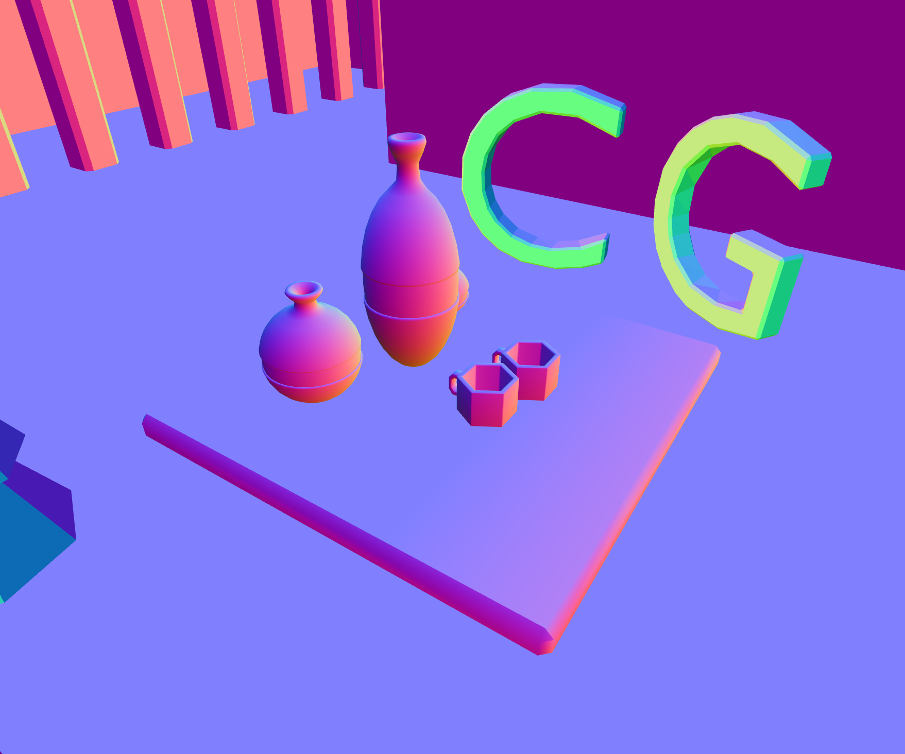
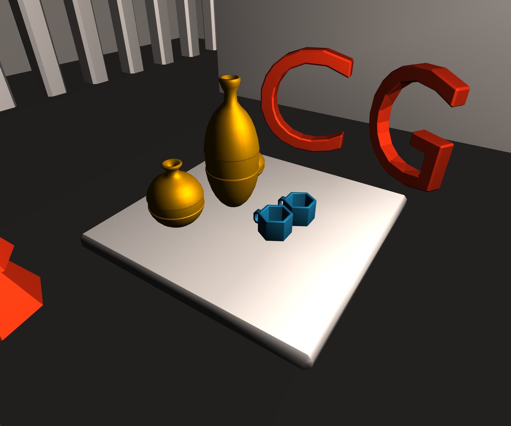
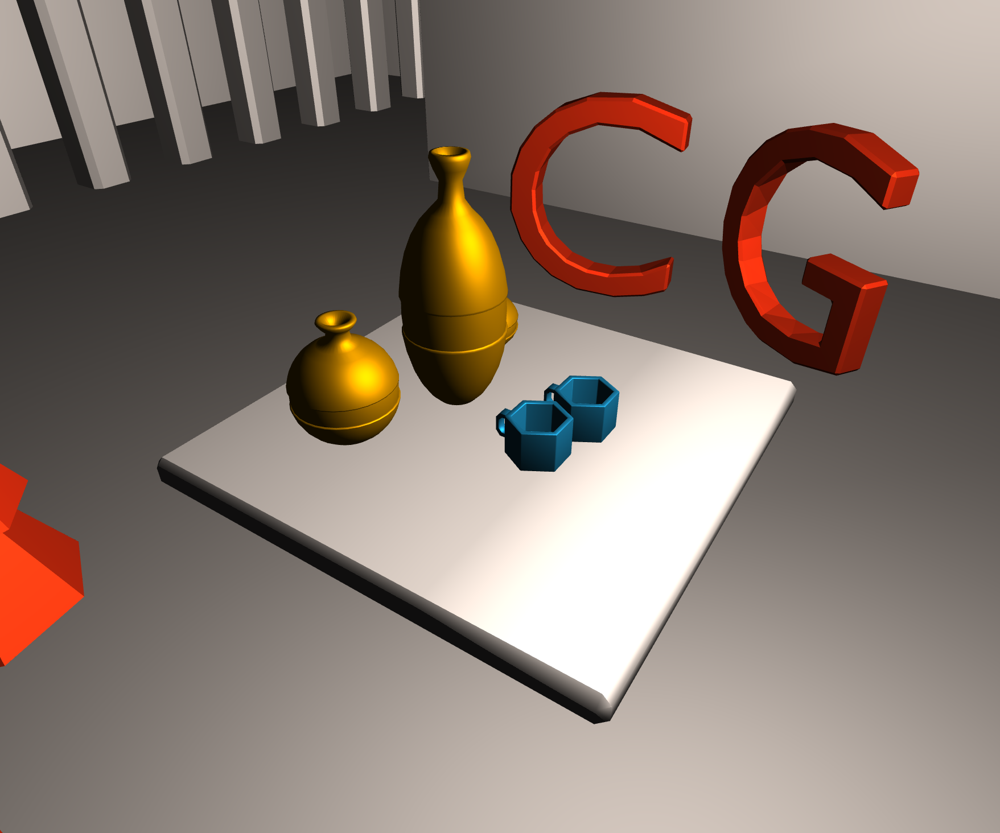

<figure id="teaser" class="captioned" style="width: 90%;"></img>
<figcaption>This week's scene rendered with Phong shading.</figcaption></figure>

In this homework, you will focus on two steps of the rasterization pipeline: normal computation and shading.
You will start by computing the normals for each triangle in the scene. 
The triangle normals will then be used to compute the vertex normals.
In turn, vertex normals will determine the appearance of the rendered objects, which differs depending on the shading strategy used.
You will implement Gouraud and Phong shading, and explore their differences.

## Computing Vertex Normals in a Triangle Mesh

The starting point of this assignment are the functions in `normal_computation.js`. 
All these computations are done once, when the pipeline is built, and thus happen outside the shader.
You will then be coding in JS and using `glMatrix`.

### `vec3` Methods in `glMatrix`
When computing normals, you will handle arrays of length 3 which benefit from functions defined for `vec3`. 
A list of available methods can be found in the [docs](https://glmatrix.net/docs/module-vec3.html). 
As an example, here is how you can compute a cross product between two arrays of length 3:

```js
const a = [1., 0., 0.]
const b = [0., 1., 0.]
const c = vec3.cross([0., 0., 0.], a, b)
// c is equal to [0., 0., 1.]
```

Notice that we need to provide an array as first (output) parameter to `vec3.cross()`. 
More generally, for the functions listed in the above website, the `out` argument can be replaced by `[0., 0., 0.]`, which serves as a placeholder.

### Notation
A triangle of the mesh is denoted by $T_i$, and it has 3 vertices $V_{i_1}$, $V_{i_2}$, and $V_{i_3}$, with spatial coordinates $\mathbf{p}(V_{i_1})$, $\mathbf{p}(V_{i_2})$, and $\mathbf{p}(V_{i_3})$, respectively.

<figure id="fig-weights"></img></figure>

The triangle normal is denoted by $\mathbf{n}(T_i)$, and the weights for the triangle's vertices are $w_{1}(T_i)$, $w_{2}(T_i)$, and $w_{3}(T_i)$. 
These quantities are the ones you have to compute. 


<div class="box task">

#### Task GL2.1.1: Compute Triangle Normals and Opening Angles

* Fill in the method `compute_triangle_normals_and_angle_weights()` in `normal_computation.js`.
    * Compute the normal vector to each triangle in the mesh.
    * Push it into the array `tri_normals`.
    * Compute the angle weights for `vert1`, `vert2`, then `vert3` and store it into an array `[w1, w2, w3]`.
    * Push this array into `angle_weights`.

<div class="box hint">
**Hints**

 - Note the orientation of the normal with respect to the 3 vertices in the sketch above.
 - You can use `vec3` specific methods such as `normalize()`, `add()`, `cross()`, `angle()`, or `subtract()`. The absolute value of a float is given by `Math.abs()`.
 - You do not have a way to visualize the normals yet: if you open `index.html` at this stage you will probably see a blue screen. It might be beneficial to continue the assignment and implement GL2.2 before debugging this task.
</div>

</div>

You can now compute each vertex normal $\mathbf{n}(V_{i_k})$ as an average of incident triangles’ normals $\mathbf{n}(T_i)$, weighted by the opening angle $w_{k}(T_i)$.

<div class="column-left">

$$\mathbf{n}(V_{i_k}) = \dfrac{\sum_{T_i \ni V_{i_k}} w_{k}(T_i) \mathbf{n}(T_i)}{||\sum_{T_i \ni V_{i_k}} w_{i_k}(T_i) \mathbf{n}(T_i)||}$$

</div>
<div class="column-right">

  <figure id="fig-vn"></figure>

</div>

To make your implementation more efficient, instead of traversing through all the neighboring triangles of each vertex, you should loop through all the triangles of the mesh, visiting each triangle $T_i$ only once. For each vertex $V_{i_k}$ of the triangle $T_i$, add the contribution $w_{k}(T_i) \mathbf{n}(T_i)$ to the normal of the vertex $V_{i_k}$. Use the `angle_weights` array you computed in the previous task to get the weights $w_{k}$ for each triangle. After all triangles are visited, you should normalize all computed vertex normals.

<div class="box task">

#### Task GL2.1.2: Compute Vertex Normals

* Fill in the method `compute_vertex_normals()` in `normal_computation.js`.
	* Visit each triangle in the mesh.
    * Add the contribution of the current triangle to its vertices' normal.
    * Normalize the obtained vertex normals.

</div>


## Visualizing Normals

In the following tasks, you will build a simple GPU pipeline to visualize the normals.
You will need to work on several aspects of the pipeline.
In particular, you will need to have understood what is the difference between a vertex and a fragment shader, and the basic GLSL syntax required to define each of these variables, including the meaning of the `uniform`, `attribute`, and `varying` keywords.
Last week's tutorial covers the GPU pipeline basics and proposes a hands-on exercise to get familiar with these concepts.
We strongly suggest you do that exercise and make sure your understanding of the pipeline is solid, also referring to the lecture slides, before moving on.

We will use a turntable camera to navigate through the scene.
Copy your camera code from homework 3 (GL1) into `main.js`. 
Make sure to review your code and fix any potential bug we pointed out in the comments to your GL1 submission.

### Normals in the Fragment Shader

<figure id="fig-gl221" class="captioned"></img>
<figcaption>Reference normals visualization for the predefined view when pressing "1"</figcaption></figure>

In the vertex shader `normals.vert.glsl`, our computed normal are given as the attribute `vertex_normal`.
We will store it in a `varying` variable to pass it on from vertex to fragment shader and finally draw it on screen.


<div class="box task">

#### Task GL2.2.1: Passing the Normals to Fragment Shader

- Edit `mesh_render.js` to compute the model-view-projection matrix `mat_mvp`. This follows the last assignment's solution.
- Edit `normals.vert.glsl` and `normals.frag.glsl`: in both files add the declaration of a `varying` variable which will contain the normal.
- In the vertex shader, set the `varying` value.
- In the fragment shader, use the value to draw false-color representation of normals. False color is calculated as `normal * 0.5 + 0.5`.
- Make sure the normal is valid. What could have happened to it during interpolation?

</div>

After completing this task, you should finally see the scene appearing on the screen.
If the colors do not match the [reference image](#fig-gl221), go back and review your JS implementation of the normal computation, then look into potential bugs in the shader code.

### Transforming the Normals

<figure id="fig-gl222" class="captioned"></img>
<figcaption>Reference normals visualization, now transformed to view space, for the predefined view "1"</figcaption></figure>


We now need to transform the normals into our view space.

The normal-transforming matrix is equal to $(\mathbf{VM})^{-T}$, that is the inverse of transpose of model-view matrix (see the lecture slides for more details).

<div class="box task">

#### Task GL2.2.2: Transforming the normals

- Edit `mesh_render.js` and calculate `mat_mvp`, `mat_model_view`, and `mat_normals_to_view`. Normals-to-view is equal to $(\mathbf{VM})^{-T}$.
- Edit `normals.vert.glsl` and apply the transformation matrix to the normal vectors.
</div>


## Lighting

In this task, you will implement the Blinn-Phong lighting model and use it to illuminate the scene. 
Recall the general Phong lighting model definition:

<figure id="fig-BlinnPhong" class="captioned"></img>
<figcaption>Half vector $\mathbf{h}$ in Blinn-Phong lighting model.</figcaption></figure>

$$\mathbf{I}_{BP} = \mathbf{I}_a*\mathbf{m}_a + 
\sum_{\mbox{light}\; l} \left[
	\mathbf{I}_l*(\mathbf{m}_d.(\mathbf{n}^T\mathbf{l}) + \mathbf{m}_s.(\mathbf{h}^T\mathbf{n})^s)
\right]$$

where $\mathbf{I}_{BP}$ is the final fragment's intensity, $\mathbf{I}_{a}$ is the ambient component of the light source, 
$\mathbf{I}_{l}$ is the diffuse/specular component, 
$\mathbf{m}_{[a|d|s]}$ is the ambient/diffuse/specular coefficient of the material, 
$s$ is the shininess, and $\mathbf{n}, \mathbf{l}, \mathbf{h}, \mathbf{v}$ are the normal, light, half-vector, and view vectors, respectively.
Recall that the diffuse component is only added if $\mathbf{n} \cdot \mathbf{l} > 0$ and the specular component is only added 
if both $\mathbf{n} \cdot \mathbf{l} > 0$ and $\mathbf{n} \cdot \mathbf{h} > 0$.

In our scene, we consider a single point light source (see `light_position_world` and `light_color` variables defined in `main.js`) which provides the $\mathbf{I}_{l}$ component. 
We'll assume the material components $\mathbf{m}_{[d|s]}$ are both just equal to the RGB color of the object stored in the variable `material_color`, without a scalar weight (i.e., in terms of the notation used in assignment RT2, we have `material.diffuse = material.specular = 1.0`).
$\mathbf{I}_{a}$ is usually thought of as the combined dispersed contribution of all the light sources in the scene.
We set the ambient component $\mathbf{m}_a$ equal to `material_color * material_ambient`, where `material_ambient = 0.1`.


### Per-Vertex (Gouraud) Shading

<figure id="fig-gl23" class="captioned"></img>
<figcaption>Reference Gouraud shading for the predefined view when pressing "1"</figcaption></figure>

In the Gouraud shading model, we compute the lighting value for each vertex in the vertex shader, store the resulting color and interpolate it over the drawn triangle.

<div class="box task">

#### Task GL2.3: Gouraud Shading

- Edit `shade_pervertex.vert.glsl` to compute the lighting value per-vertex. 
- Store the color in a `varying` variable (like with normals visualization).
- Edit `shade_pervertex.frag.glsl` to display the resulting color.

<div class="box hint">
**Hint**

These calculations happen in view-space.
To put the vertex position into view space, we apply the model-view matrix. 
This is different from the model-view-projection, which goes to screen coordinates, instead.
</div>

</div>


### Per-Pixel (Phong) Shading

<figure id="fig-gl24" class="captioned"></img>
<figcaption>Reference Phong shading for the predefined view when pressing "1"</figcaption></figure>

Gouraud shading can be inaccurate. In the example above we can see that the floor is dark.
This is because the floor is composed of large triangles.
The light values at the far-away corners do not correspond at all to the correct light in the middle of the plane.
Therefore for better accuracy we will compute the shading per pixel, not per vertex.

<div class="box task">

#### Task GL2.4: Phong Shading

- Edit `shade_perpixel.vert.glsl`:
  * Setup the `varying` values to pass on to the fragment shader: surface normal, view vector, light vector.
  * Compute the surface normal, view vector, light vector in the vertex shader.
- Edit `shade_perpixel.frag.glsl`:
  * Implement the Blinn-Phong formula using the passed on values.
  * Make sure to normalize vectors which might have been affected by interpolation.
  * Display the resulting color.
</div>


## Grading

* **20%** Task 1.1: Compute triangle normals and opening angles
* **20%** Task 1.2: Compute vertex normals
* **15%** Task 2.1: Pass normals to fragment shader
* **5%**  Task 2.2: Transform the normals
* **20%** Task 3:   Gouraud shading
* **20%** Task 4:   Phong shading


## What to Submit

Please edit the file `readme.md` adding a brief description (approximately 10 to 20 lines) of how you solved the proposed exercises. 
In the same file, report individual contributions following this scheme (sciper in parentheses):

	Name1 Surname1 (000001): 1/3
	Name2 Surname2 (000002): 1/3
	Name3 Surname3 (000003): 1/3

We ask you to only report global contributions, there is no need to provide additional details for each sub-task. 
The three contributions should add up to 1.

Compress the directory with all the files it contains – the source code with your solution, the source code you did not modify, the libraries, the readme, etc. – into a `.zip` archive. Rename the zipped file into `Exercise4-Group<GX>.zip`, where `<GX>` is your group number, according to the group you enrolled in on Moodle.

Note that it is your responsibility to check that all the components necessary to run the code are included. We will run your web app to generate the results. These results will determine your grade.
