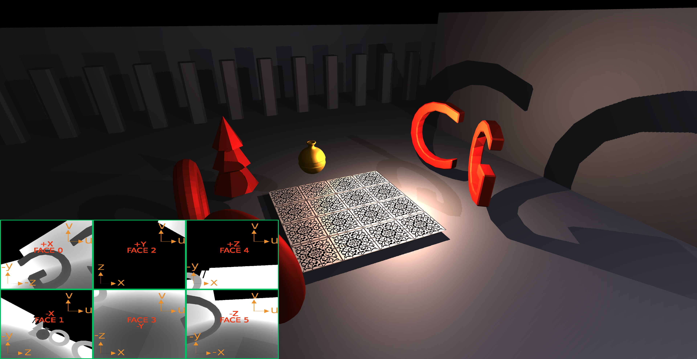
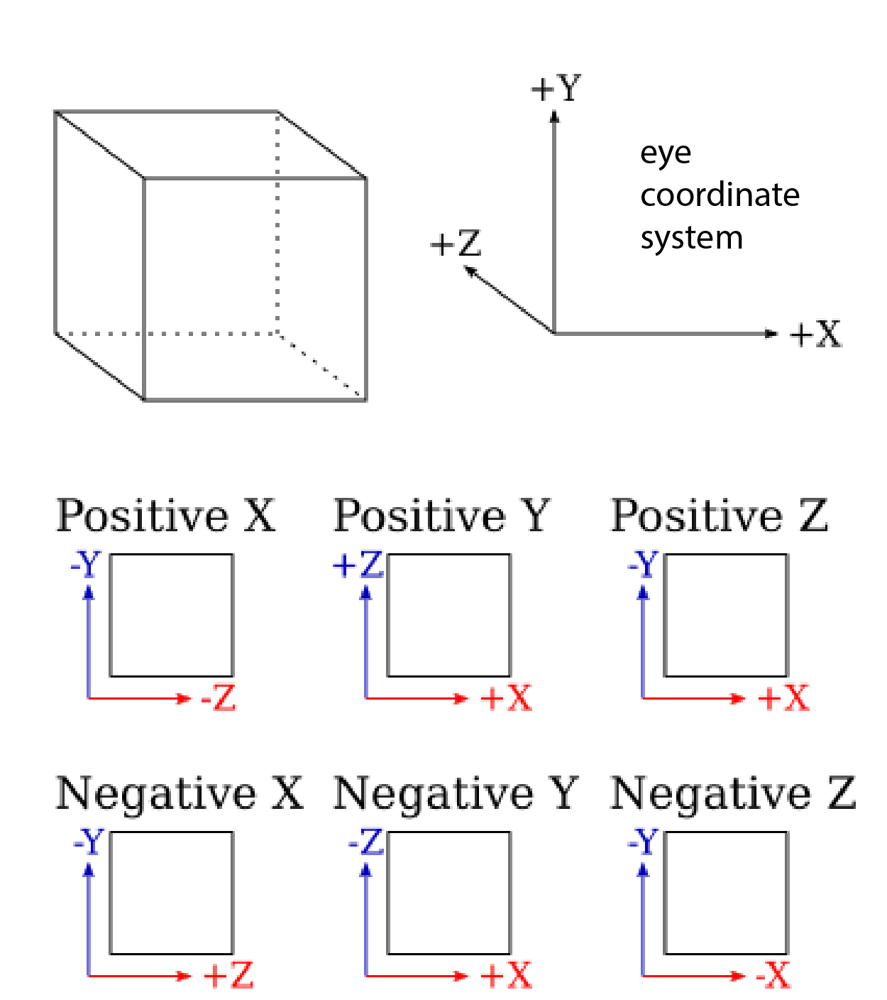

<figure id="fig-gl331" class="captioned"></img>
<figcaption>One of our test scenes with real-time shadows.</figcaption></figure>

In this assignment, you will start by looking into textures and how they can be used to add color details to your scene.
You will then implement a real-time algorithm to render reflective objects, and a shadowing method for multiple omni-directional point lights.
Both these techniques are based on cube maps, which you will have to implement step by step.


## Textures

Textures are an important tool in graphics. 
They represent per-pixel data such as surface colors, material parameters, or normals.
They are often loaded from image files - you can see the texture files in the `textures` directory.

Let us start by using textures to control the surface color of our objects.

A sky-sphere is a simple technique that can give spectacular results.
We instantiate a large sphere around the scene and color it with a texture representing the 360 degree view of scenery.
There are many background panoramas freely available online, for example at <https://hdri-haven.com> or <https://polyhaven.com/hdris>.

Sampling a texture in GLSL is done via the [`texture2D`](https://thebookofshaders.com/glossary/?search=texture2D) function, which has the following signature:

```c
vec4 texture2D(sampler2D sampler, vec2 coord)
```

where `sampler` is an object providing the full texture from whic to sample, and `coord` specifies the value of the two texture coordinates, usually called `u` and `v`, at the desired sampling point.
The function receives as input a variable specifying the texture to sample from (`tex_color`) and the in the example below, which is a `vec4` variable:
The function returns a `vec4` whose first three components represent the RGB channels.
We usually do not need the 4-th component.

Before starting this assignment, make sure to:

* Copy your turntable camera code from GL1 into `main.js`.
* Complete the `make_transformation_matrices` function in `mesh_render.js` with your solution from GL2 where you set up `mat_mvp`, `mat_model_view` and `mat_normals_to_view`.

<div class="box task">

#### Task GL3.1.1: Sampling a Texture

Edit `shaders/unshaded.frag.glsl` to sample the texture `tex_color` at the UV coordinates passed by the vertex shader,
and output the texture color.

</div>

### Texture (UV) Coordinates and Wrapping

<figure id="fig-gl31" class="captioned"></img>
<figcaption>The expected result for texture wrapping, with tiles repeating 4 times.</figcaption></figure>


The texture coordinates, often named UV coordinates, specify the correspondence between mesh vertices and points on a texture.
In the lecture we have seen how this allows to map a mesh face onto a flat texture.
Setting the vertex UV coordinates is part of the mesh creation process, and it is usually called *UV unwrapping*.
You can assume this step has already been taken care of for all the meshes we provide.

<div class="box project">

##### Project Hints

When you will design your own meshes, you might need to do the unwrapping yourself.
Blender provides advanced tools for UV unwrapping.
In its simplest form, and for topologically trivial meshes, unwrapping is just a matter of running an automatic algorithm.
More complex meshes might require additional manual edits, like the definition of patch seams.

[This](https://docs.blender.org/manual/en/latest/modeling/meshes/uv/unwrapping/introduction.html) page in the Blender docs provides an introduction of UV unwrapping.
Pin it: you will likely need it for the final project.
 
</div>

In this section we will modify the UV coordinates of a simple square mesh.
We colored it with a tile texture, but we would like the tiles to repeat several times.

When reading from a texture, we provide the UV sampling coordinates.
The image spans from `[0, 0]` to `[1, 1]` UV coordinates. 
Sampling within this range simply displays the image.

What happens when we sample beyond the range? 
That is decided by the texture wrapping mode.
We have these modes available: `clamp`, `repeat`, `mirror` (see the [REGL docs](https://github.com/regl-project/regl/blob/master/API.md#texture-constructor)).
Try them out to see which achieves the desired result.

<div class="box task">

#### Task GL3.1.2: UV Coordinates and Wrapping Modes

1. Edit the UV coordinates of the square mesh in `meshes_construct` in `scene.js` to repeat the texture 4 times.
2. Set the floor texture wrapping mode in `tex_load_options` in `scene.js` to achieve a tiled floor.

</div>

## Environment Mapping

We will use environment mapping to achieve two effects: real-time reflections and shadows.

We will use a cube map to capture a 360 degree view from a given point in the scene.
Cube maps are somewhat similar to the sky-sphere texture. 
However, instead of using a single image, the texture is stored in a 6-sided cube where each side looks in a different direction.

### Cube Maps

A cube map texture is a collection of six textures that are conceptually attached to the faces of a cube. 
Instead of sampling this cube map with 2D texture coordinates $(s, t)$, you sample it with a 3D vector $(s, t, r)$;
the GPU then returns the color of the point on the cube where this 3D vector pierces through the cube.

<figure class="captioned">
	
	<figcaption class='justified'>
    Figure 1. Sampling a cube map.
	</figcaption>
</figure>

This sampling mechanism is a perfect fit for the effects we want to render. 
For real-time reflections, we can sample the environment texture by mimicking the ability to shoot a ray from the center of the reflecting object.
For shadow mapping, sampling the cube map with the shadow ray vector pointing from the light to a point of interest $\mathbf{p}$ will return the intersection distance value for this ray (as long as we correctly rendered each face's shadow map).

The $6$ texture images making up the cube map are oriented and wrapped around the cube as shown in Figure 2.

<figure class="captioned">
    
	<figcaption class='justified'>
    Figure 2. Cube mapping texture coordinate systems for a standard right-handed reference system (from [Wikipedia](https://en.wikipedia.org/wiki/Cube_mapping)).
	This convention is used in many graphic engines like, for example, [Unity](https://docs.unity3d.com/Manual/class-Cubemap.html).
	</figcaption>
</figure>

To better understand the reference system conventions, let us focus on the shadow map case—reflections work in an analogous way. 
Figure 3 shows the naming scheme for cube map faces, using a convention for the reference system consistent with Figure 2.

<figure class="captioned">
    
	<figcaption class='justified'>
    Figure 3. (a) Names of the shadow map cube faces.
    (b-d) Example of the light camera coordinate axes oriented to render faces 0, 2, and 4, respectively.
	</figcaption>
</figure>

Figure 4 shows the shadow map cube for an omnidirectional point light source. For each of the six cube faces, a separate shadow map texture needs to be computed. 

<figure class="captioned">
    
    <figcaption class='justified'>
    Figure 4.
    (a) The shadow cube map for the omnidirectional point light source L.
	The setup for rendering `face 3`'s map is visualized.
	The coordinate axes indicate the orientation of the light camera used to render the shadow map;
	as usual for WebGL, the camera looks along the -`z axis`.
    (b) The resulting shadow map texture (darker is closer).
    </figcaption>
</figure>

### Cube Maps in WebGL
In WebGL, cube maps traditionally use a different convention for the coordinate system (see the [OpenGL docs](https://www.khronos.org/opengl/wiki/Cubemap_Texture)).
For cube maps, the reference eye coordinate system is taken left-handed.
This means that the positive x-axis points to the right, the positive y-axis points up, 
and the positive z-axis points into the screen—instead of out of it as in a right-handed system.

<figure class="captioned">
    
	<figcaption class='justified'>
    Figure 5. The cube map convention in WebGL considers a left-handed
	eye coordinate system to define the orientation of the local frames when 
	looking through each of the six faces (see [OpenGL Wiki](https://www.khronos.org/opengl/wiki/Cubemap_Texture)).
	</figcaption>
</figure>

This implies that, despite the numbering of the faces being the same as in Figure 2 and 3, 
the up vectors in WebGL are different from the ones used in right-handed cube map implementations.

Since we are using the `regl` library, we will follow this convention.
Our interface is then consistent with Figure 5.
Note that, in practice, the difference between Figure 2 and Figure 5 is just a change of sign.
We mention both as in your future experience as a developer you might need to work with either of the two.

### Building View and Projection Matrices for a Cube Face

<figure id="fig-gl322" class="captioned"></img>
<figcaption>Reference result for the cube map implementation for real-time reflections.</figcaption></figure>

We start by constructing the `cube_camera_projection` matrix in `env_capture.js`.
Remember that we use the shadow map case to illustrate and discuss the properties of a cube map, but reflections work analogously.

Note that the shadow map cube model assumes the light is positioned at the center of the cube.
Given such a geometry, think of what aspect ratio and field of view properly define the light camera's view frustum as visualized in Figure 4.
The near/far parameters control the minimum and maximum distances at which you can compute shadow ray intersections. 
For this scene, you can use $0.1$ and $200$ respectively.

<div class="box task">

#### Task GL3.2.1: Projection Matrix for a Cube Camera

Complete the function `init_capture` in `env_capture.js`. 
Use `mat4.perspective` to produce the projection matrix for a camera whose center lies at the center of a cube and whose image plane is a face of the cube.
Choose the correct field-of-view angle and aspect ratio.

</div>


The `cube_camera_view` function constructs the view matrix for the light camera looking through side `side_idx` in {0, ..., 5} of the shadow map cube.
This is the matrix representing the transformation from the world coordinate system to the coordinate system for the light camera.

Note that the orientation of the shadow map cube itself (i.e., the shadow map cube coordinate system) must always be aligned with the current eye coordinate system (see Figure 3 (a)).
This will allow you sample the cube map texture directly with the light vectors calculated in your Phong shader, since your lighting calculation is done in eye space.
Therefore, the `cube_camera_view` matrix uses the current eye's view matrix.

We are also using the function `mat4.lookAt` to point the camera through the specified cube face. 

Please set up the `up` vectors for the `lookAt` function for each face being consistent with the conventions depicted in Figure 5.

<div class="box task">

#### Task GL3.2.2: Up Vectors for Cube Camera

Edit the up vectors `CUBE_FACE_UP` in `env_capture.js` to point the camera through the specified cube faces.
Please check that your scene capture visualization (bottom left) matches the reference image.
</div>


### Reflections from Environment Capture

<!-- <figure id="fig-phong-reflection" class="captioned"></img>
<figcaption>Reflected ray direction.</figcaption></figure> -->


In the previous part we have captured a view from a particular point in the scene into a cubemap.
Sampling this cube map allows us to recover the light ray coming from that direction.
We will use it to implement real-time reflections.

The idea is similar to reflections in homework 2 (RT2).
There we could run the ray tracer to shoot a ray in any direction.
In the rasterization pipeline we have to draw whole objects from a fixed viewpoint.
Thus the environment map will serve as an approximation of the ability to shoot rays.

The approximation relies on an assumption that the shiny object is small compared to the whole scene.
We capture the view from the center of the object and assume that this is not significantly different from the view from the object surface.

Sampling a cube map is similar to sampling a texture but takes a 3D vector instead of 2D UV:

```c
vec4 result = textureCube(cube_env_map, direction_vec3);
```

<div class="box task">

#### Task GL3.2.3: Reflection Shader

Edit the reflection shaders `mirror.vert.glsl` and `mirror.frag.glsl` to implement reflections based on the environment map.

1. Pass the view-space normals and the viewing direction from the vertex shader to the fragment shader.
This is a slight adaptation of your solution for GL2. Normalize vectors which ought to be unit vectors.
2. Calculate the reflected ray direction $\mathbf{r}$ in your fragment shader, then sample the cube map to get the color of the reflected ray.

</div>


## Shadow Mapping

### Review on Phong Lighting and Shadows

Recall the Phong illumination model you have used in the previous assignments:


<!-- <figure id="fig-BlinnPhong" class="captioned"></img>
<figcaption>Half vector $\mathbf{h}$ in Blinn-Phong lighting model.</figcaption></figure> -->

$$\mathbf{I}_{BP} = \mathbf{I}_a*\mathbf{m}_a + 
\sum_{\mbox{light}\; l} \left[
	\mathbf{I}_l*(\mathbf{m}_d.(\mathbf{n}^T\mathbf{l}) + \mathbf{m}_s.(\mathbf{h}^T\mathbf{n})^s)
	\frac{1}{\text{dist}(l, p)^2}
\right]
$$


<!-- { width=60% #fig:singleShadowma } -->

where the final fragment's intensity, $\mathbf{I}_{BP}$, is computed adding specular and diffuse contributions from each light, $l$, atop the ambient contribution.
Recall that $\mathbf{I}_{a}$ is the ambient light intensity, $\mathbf{I}_{l}$ is diffuse/specular intensity of light source $l$, $\mathbf{m}_{[a|d|s]}$ is the ambient/diffuse/specular component of the material, $s$ is
the shininess, and $\mathbf{n}, \mathbf{l}, \mathbf{h}, \mathbf{v}$ are the
normal, light, half-vector, and view vectors respectively.

Notice the addition of the distance attenuation factor $1/\text{dist}(l, p)^2$, where $p$ is the point being lit, in the light intensity term compared to the Phong model from the previous assignments.

As in the previous homework (GL2), we will assume $\mathbf{m}_{d}$ = $\mathbf{m}_{s}$ = `material_color` (i.e. the coefficients `material.diffuse` and `material.specular` from RT2 are unitary)
The color is sampled from a given texture.
We set $\mathbf{m}_a$ = `material_color * material_ambient`, where `material_ambient = 1e-4`.

Remember that, in the second raytracing assignment, you computed shadows by neglecting the contributions from lights that are hidden by other scene geometry. 
To do this, you cast a shadow ray from the point $\mathbf{p}$ being lit to the light to check if there was an intersection between the two.

An equivalent formulation of this test, which we will see is more compatible with
the WebGL/regl rasterization pipeline, is to instead cast a ray from the light toward the point and check
if there is any intersection *closer* to the light than $\mathbf{p}$ is. 
If so, then $\mathbf{p}$ is in a shadow, and no diffuse or specular components from this light should be added.

<figure class="row">
{ width=35% }
{ width=35% }
</figure>

## Real-Time Shadows with Shadow Mapping
The nice thing about this new shadow test formulation is that determining the first intersection
of a whole frustum of rays with a scene is exactly the problem GPU rasterization pipeline solves: 
we can simply render the scene from the perspective of the light to determine the
distance of the closest intersection along every light ray. 
The resulting grayscale image of distance values is called a shadow map. 
Note that, when the eye is placed inside the light cube to render the shadow map, 
we will refer to it as the *light camera* to distinguish it from the viewpoint used to render the image on screen.

<figure class="row center">
    { width=35% }
    { width=35% }
</figure>
<figcaption>
    From Akenine-Moller, "Real-Time Rendering."
</figcaption>

Then, when computing the lighting for point $\mathbf{p}$, we can compare its distance from the light
against the corresponding ray's intersection distance value stored in this shadow map. 
This test involves only an efficient, constant-time texture look-up operation.

Shadow mapping implementations traditionally store the depth buffer (or `z-buffer`) value in the shadow map.
However, for omnidirectional lighting, it will be simpler to instead work with
**the Euclidean distance from the light to the intersection point**.
When we switch to the shadow mode, the cubemap visualizer shows the shadow map.


With this approach, we need the following multi-pass rendering process:

```
for all rasterized framgents p:
	I(p) <- ambient_contribution

for all lights l in the scene:
	draw shadow map for l by computing distances to each fragment seen by l
	for all rasterized fragments p:
		if length(p - l.pos) < shadowmap_depth:
			I(p) <- I(p) + diffuse_contribution(p, l)
			I(p) <- I(p) + specular_contribution(p, l)

```

<!-- <script src="doc/pseudocode.min.js"></script>
<div style='width: 70%; margin: 0 auto;'>
<pre id="shadowmapPseudocode" style="display:hidden;">
\begin{algorithm}
\caption{Phong Lighting with Shadow Maps}
\begin{algorithmic}
	\ForAll{rasterized fragments ``$\mathbf{p}$''}
		\State $I(\mathbf{p}) \gets \texttt{ambient\_contribution}$
	\EndFor
	\For{lights $l$ in the scene}
		\State Draw shadow map for $l$ by computing distances to each fragment seen by $l$
		\ForAll{rasterized fragments ``$\mathbf{p}$''}
			\If{$\texttt{length}(\mathbf{p} - l.\texttt{pos}) < \texttt{shadowmap\_depth}$} 
				\State $I(\mathbf{p}) \gets I(\mathbf{p}) + \texttt{diffuse\_specular\_contribution}$
			\EndIf
		\EndFor
	\EndFor
\end{algorithmic}
\end{algorithm}
</pre>
</div>
<script>
pseudocode.renderElement(document.getElementById("shadowmapPseudocode"));
</script>-->
<!-- 
<div style="margin: 0 auto;">
<div class="ps-root">
<div class="ps-algorithm with-caption">
<p class="ps-line" style="text-indent:-1.2em;padding-left:1.2em;">
<span class="ps-keyword">Algorithm 1 </span>Phong Lighting with Shadow Maps</p>
<div class="ps-algorithmic">
<div class="ps-block" style="margin-left:1.2em;">
<p class="ps-line ps-code">
<span class="ps-keyword">for all </span>rasterized fragments ‘‘<span class="katex"><span class="katex-mathml"><math xmlns="http://www.w3.org/1998/Math/MathML"><semantics><mrow><mi mathvariant="bold">p</mi></mrow><annotation encoding="application/x-tex">\mathbf{p}</annotation></semantics></math></span><span class="katex-html" aria-hidden="true"><span class="base"><span class="strut" style="height:0.63888em;vertical-align:-0.19444em;"></span><span class="mord"><span class="mord mathbf">p</span></span></span></span></span>’’<span class="ps-keyword"> do</span></p>
<div class="ps-block" style="margin-left:1.2em;">
<p class="ps-line ps-code">
<span class="katex"><span class="katex-mathml"><math xmlns="http://www.w3.org/1998/Math/MathML"><semantics><mrow><mi>I</mi><mo stretchy="false">(</mo><mi mathvariant="bold">p</mi><mo stretchy="false">)</mo><mo>←</mo><mtext mathvariant="monospace">ambient_contribution</mtext></mrow><annotation encoding="application/x-tex">I(\mathbf{p}) \gets \texttt{ambient\_contribution}</annotation></semantics></math></span><span class="katex-html" aria-hidden="true"><span class="base"><span class="strut" style="height:1em;vertical-align:-0.25em;"></span><span class="mord mathdefault" style="margin-right:0.07847em;">I</span><span class="mopen">(</span><span class="mord"><span class="mord mathbf">p</span></span><span class="mclose">)</span><span class="mspace" style="margin-right:0.27em;"></span><span class="mrel">←</span><span class="mspace" style="margin-right:0.27em;"></span></span><span class="base"><span class="strut" style="height:0.70625em;vertical-align:-0.09514em;"></span><span class="mord text"><span class="mord texttt">ambient_contribution</span></span></span></span></span></p>
</div>
<p class="ps-line ps-code">
<span class="ps-keyword">end for</span></p>
<p class="ps-line ps-code">
<span class="ps-keyword">for </span>lights <span class="katex"><span class="katex-mathml"><math xmlns="http://www.w3.org/1998/Math/MathML"><semantics><mrow><mi>l</mi></mrow><annotation encoding="application/x-tex">l</annotation></semantics></math></span><span class="katex-html" aria-hidden="true"><span class="base"><span class="strut" style="height:0.69444em;vertical-align:0em;"></span><span class="mord mathdefault" style="margin-right:0.01968em;">l</span></span></span></span> in the scene<span class="ps-keyword"> do</span></p>
<div class="ps-block" style="margin-left:1.2em;">
<p class="ps-line ps-code">
Draw shadow map for <span class="katex"><span class="katex-mathml"><math xmlns="http://www.w3.org/1998/Math/MathML"><semantics><mrow><mi>l</mi></mrow><annotation encoding="application/x-tex">l</annotation></semantics></math></span><span class="katex-html" aria-hidden="true"><span class="base"><span class="strut" style="height:0.69444em;vertical-align:0em;"></span><span class="mord mathdefault" style="margin-right:0.01968em;">l</span></span></span></span> by computing distances to each fragment seen by <span class="katex"><span class="katex-mathml"><math xmlns="http://www.w3.org/1998/Math/MathML"><semantics><mrow><mi>l</mi></mrow><annotation encoding="application/x-tex">l</annotation></semantics></math></span><span class="katex-html" aria-hidden="true"><span class="base"><span class="strut" style="height:0.69444em;vertical-align:0em;"></span><span class="mord mathdefault" style="margin-right:0.01968em;">l</span></span></span></span></p>
<p class="ps-line ps-code">
<span class="ps-keyword">for all </span>rasterized fragments ‘‘<span class="katex"><span class="katex-mathml"><math xmlns="http://www.w3.org/1998/Math/MathML"><semantics><mrow><mi mathvariant="bold">p</mi></mrow><annotation encoding="application/x-tex">\mathbf{p}</annotation></semantics></math></span><span class="katex-html" aria-hidden="true"><span class="base"><span class="strut" style="height:0.63888em;vertical-align:-0.19444em;"></span><span class="mord"><span class="mord mathbf">p</span></span></span></span></span>’’<span class="ps-keyword"> do</span></p>
<div class="ps-block" style="margin-left:1.2em;">
<p class="ps-line ps-code">
<span class="ps-keyword">if </span><span class="katex"><span class="katex-mathml"><math xmlns="http://www.w3.org/1998/Math/MathML"><semantics><mrow><mtext mathvariant="monospace">length</mtext><mo stretchy="false">(</mo><mi mathvariant="bold">p</mi><mo>−</mo><mi>l</mi><mi mathvariant="normal">.</mi><mtext mathvariant="monospace">pos</mtext><mo stretchy="false">)</mo><mo>&lt;</mo><mtext mathvariant="monospace">shadowmap_depth</mtext></mrow><annotation encoding="application/x-tex">\texttt{length}(\mathbf{p} - l.\texttt{pos}) &lt; \texttt{shadowmap\_depth}</annotation></semantics></math></span><span class="katex-html" aria-hidden="true"><span class="base"><span class="strut" style="height:1em;vertical-align:-0.25em;"></span><span class="mord text"><span class="mord texttt">length</span></span><span class="mopen">(</span><span class="mord"><span class="mord mathbf">p</span></span><span class="mspace" style="margin-right:0.22em;"></span><span class="mbin">−</span><span class="mspace" style="margin-right:0.22em;"></span></span><span class="base"><span class="strut" style="height:1em;vertical-align:-0.25em;"></span><span class="mord mathdefault" style="margin-right:0.01968em;">l</span><span class="mord">.</span><span class="mord text"><span class="mord texttt">pos</span></span><span class="mclose">)</span><span class="mspace" style="margin-right:0.27em;"></span><span class="mrel">&lt;</span><span class="mspace" style="margin-right:0.27em;"></span></span><span class="base"><span class="strut" style="height:0.833em;vertical-align:-0.22em;"></span><span class="mord text"><span class="mord texttt">shadowmap_depth</span></span></span></span></span><span class="ps-keyword"> then</span></p>
<div class="ps-block" style="margin-left:1.2em;">
<p class="ps-line ps-code">
<span class="katex"><span class="katex-mathml"><math xmlns="http://www.w3.org/1998/Math/MathML"><semantics><mrow><mi>I</mi><mo stretchy="false">(</mo><mi mathvariant="bold">p</mi><mo stretchy="false">)</mo><mo>←</mo><mi>I</mi><mo stretchy="false">(</mo><mi mathvariant="bold">p</mi><mo stretchy="false">)</mo><mo>+</mo><mtext mathvariant="monospace">diffuse_specular_contribution</mtext></mrow><annotation encoding="application/x-tex">I(\mathbf{p}) \gets I(\mathbf{p}) + \texttt{diffuse\_specular\_contribution}</annotation></semantics></math></span><span class="katex-html" aria-hidden="true"><span class="base"><span class="strut" style="height:1em;vertical-align:-0.25em;"></span><span class="mord mathdefault" style="margin-right:0.07847em;">I</span><span class="mopen">(</span><span class="mord"><span class="mord mathbf">p</span></span><span class="mclose">)</span><span class="mspace" style="margin-right:0.27em;"></span><span class="mrel">←</span><span class="mspace" style="margin-right:0.27em;"></span></span><span class="base"><span class="strut" style="height:1em;vertical-align:-0.25em;"></span><span class="mord mathdefault" style="margin-right:0.07847em;">I</span><span class="mopen">(</span><span class="mord"><span class="mord mathbf">p</span></span><span class="mclose">)</span><span class="mspace" style="margin-right:0.22em;"></span><span class="mbin">+</span><span class="mspace" style="margin-right:0.22em;"></span></span><span class="base"><span class="strut" style="height:0.833em;vertical-align:-0.22em;"></span><span class="mord text"><span class="mord texttt">diffuse_specular_contribution</span></span></span></span></span></p>
</div>
<p class="ps-line ps-code">
<span class="ps-keyword">end if</span></p>
</div>
<p class="ps-line ps-code">
<span class="ps-keyword">end for</span></p>
</div>
<p class="ps-line ps-code">
<span class="ps-keyword">end for</span></p>
</div>
</div>
</div>
</div>
</div> -->

<!-- `src/shaders/ambient_color.frag.glsl` and -->

In our implementation, the loops over rasterized fragments will be executed by 
the fragment shader
`src/shaders/phong_shadow.frag.glsl`. The shadow map distance values are written
by `src/shaders/shadowmap_gen.frag.glsl`.

### Shaders and Blend Options

<!-- ### TASK 6.2.1: Light Depth Fragment Shader
In `src/shaders/shadowmap_gen.frag.glsl`, finish the todo item `6.2.1`, calculating the fragment distance.

Note that the `shadowmap_gen` fragment shader should write the **Euclidean distance** to the
fragment instead of its z (depth) coordinate.

After completing this task,
you can verify your implementation by pressing the `c` key and comparing with the ground-truth
shadow maps:

{ width=50% }

---------------- -->

<div class="box task">

#### Task GL3.3.1: Phong Lighting Shader with Shadows

Edit `shaders/phong_shadow.vert.glsl` and `shaders/phong_shadow.frag.glsl` to implement Phong lighting with shadows.
It is quite similar to the Blinn-Phong shader from GL2 but with several differences:

* We pass the *fragment position in camera space* (`mat_model_view * vpos`) to the fragment shader.
We will use it in the fragment shader to calculate the *view direction*, *lighting direction*, and *distance between fragment and light*.
Therefore we no longer need to pass view and lighting directions to the fragment shader.
* To simulate the attenuation of light emitted from a point source over distance, please
scale the light color by the inverse squared distance from the light to the fragment.
Note that the given `light_color`s have high values to account for the attenuation.
Without the attenuation implemented, your image will be oversaturated.
* Use the `cube_shadowmap` to test whether the fragment is under shadow; 
your shader should only output a nonzero color if  the light is visible from the fragment. 
You can use the GLSL function `textureCube` to sample the cube map texture using a vector.
Mitigations against shadow acne might be needed.

</div>


### Add the Light Contributions

<div class="box task">

#### Task GL3.3.2 Blend Options

In `mesh_render.js`, `SysRenderMeshesWithLight::init_pipeline` set the blending mode of the pipeline.
</div>

We need each iteration of our loop over the lights to **add** to the
current image, not overwrite it. This can be accomplished by enabling blending
and appropriately configuring the blend function. You will want to change the `blend`
field to look like:
```
		blend: {
			enable: true,
			func: {
				src: sfactor,
				dst: dfactor,
			},
		},
```
which corresponds to a call to the OpenGL function `glBlendFunc(sfactor, defactor)`. 
To determine the correct arguments to pass as `sfactor` and `dfactor`, please study the [OpenGL reference page](https://www.khronos.org/registry/OpenGL-Refpages/gl4/html/glBlendFunc.xhtml)
and think about how to make the blend operation *add* the source and destination
values. You may also find it useful to read the `regl` documentation on blending [here](https://github.com/regl-project/regl/blob/main/API.md#blending).

If your implementation is correct, you should now see the final result displayed in the first figure of this handout.


<!-- { width=75% } -->


## Grading

* **10%** Task 1.1: Sampling a Texture
* **10%** Task 1.2: UV Coordinates and Wrapping Modes
* **10%** Task 2.1: Projection Matrix for a Cube Camera
* **10%** Task 2.2: Up Vectors for Cube Camera
* **20%** Task 2.3: Reflection Shader
* **30%** Task 3.1: Phong Lighting Shader with Shadows
* **10%** Task 3.2: Blend Options


## What to Submit

Please edit the file `readme.md` adding a brief description (approximately 10 to 20 lines) of how you solved the proposed exercises. 
In the same file, report individual contributions following this scheme (sciper in parentheses):

	Name1 Surname1 (000001): 1/3
	Name2 Surname2 (000002): 1/3
	Name3 Surname3 (000003): 1/3

We ask you to only report global contributions, there is no need to provide additional details for each sub-task. 
The three contributions should add up to 1.

Compress the directory with all the files it contains – the source code with your solution, the source code you did not modify, the libraries, the readme, etc. – into a `.zip` archive. 
Rename the zipped file into `Exercise5-Group<GX>.zip`, where `<GX>` is your group number, according to the group you enrolled in on Moodle.

Note that it is your responsibility to check that all the components necessary to run the code are included. We will run your web app to generate the results. These results will determine your grade.

<!-- <div class="box grade"> -->

