# A Campfire At Midnight

  

<video src="videos/campfire_at_midnight.mov" height="300px" autoplay loop></video>

<figcaption style="text-align: center;">The flame dances gently, flickering with life — warm, wild, and never still.</figcaption>

## Abstract

This report presents the development of a real-time, interactive campfire scene built using the **regl** framework. The goal was to combine several computer graphics techniques to create a visually rich and atmospheric environment. Key features include soft shadows, SSAO, bloom effects, procedural fire and smoke, and L-System-based tree generation. The project emphasizes both technical execution and artistic expression, aiming to simulate a warm, immersive nighttime setting. This document outlines the methods used, challenges faced, and solutions implemented throughout the development process.

## Overview

Here are several views showcasing the scene from different camera perspectives:

  
  
<strong>View 1:</strong> Inside the scene, offering an immersive, up-close experience of the environment.

  
  
<strong>View 2:</strong> Near the scene along the z-axis, showing a slightly more distant perspective.

  
  
<strong>View 3:</strong> Similar distance to View 2 but from a slightly different angle for more spatial context.

  
  
<strong>View 4:</strong> A top-down perspective showing the overall layout and composition of the scene.

## Feature validation

<table>
	<caption>Feature Summary</caption>
	<thead>
		<tr>
			<th>Feature</th>
			<th>Adapted Points</th>
			<th>Status</th>
		</tr>
	</thead>
	<tbody>
		<tr>
			<td>Soft Shadows</td>
			<td>10</td>
			<td style="background-color: #d4edda;">Completed</td>
		</tr>
		<tr>
			<td>SSAO</td>
			<td>10</td>
			<td style="background-color: #d4edda;">Completed</td>
		</tr>
		<tr>
			<td>PTG</td>
			<td>10</td>
			<td style="background-color: #d4edda;">Completed</td>
		</tr>
		<tr>
			<td>L-Systems</td>
			<td>10</td>
			<td style="background-color: #d4edda;">Completed</td>
		</tr>
		<tr>
			<td>Mesh/Scene Design</td>
			<td>5</td>
			<td style="background-color: #d4edda;">Completed</td>
		</tr>
		<tr>
			<td>Bloom</td>
			<td>5</td>
			<td style="background-color: #d4edda;">Completed</td>
		</tr>
	</tbody>
</table>

### Feature 1 : Procedurally Generated Texture

#### Implementation

To achieve a realistic flame effect in our scene, we used procedural generation techniques to create both the flame's mesh and texture. This approach allows for a dynamic visual representation that simulates the behavior of real flames.

__-> Mesh Generation and Noise Functions:__  

The flame mesh is generated using the `fire_build_mesh` function, which takes into account a height map, a base flame level, and a time parameter. The height map defines the shape of the flame, and the Perlin noise algorithm is used to introduce variability to the flame's appearance.

To create the height map, we use the `create_height_map` method, which generates a 2D grid of float values based on a sine-cosine wave pattern. This pattern simulates elevation data that can be influenced by time-dependent offsets. The resulting height map is then used to construct a grid of vertices, where each vertex's height is influenced by multiple noise functions, including:

- **Base flame height** from a Perlin noise generator
- **Turbulence** for chaotic movement
- **Detail noise** for finer variations

These noise functions work together to create a realistic and dynamic flame shape. To ensure proper lighting and shading on the mesh, we compute normals using height values from neighboring vertices.

__-> Texture Application and Animation:__  

The flame texture is designed to reflect realistic flame colors and is updated dynamically. We achieve this through:

- **Color Cycling**: A set of predefined flame colors is cycled through over time, creating a smooth animation. This is managed in the `evolve` method of the flame actor, where a timer tracks the interval between updates.
- **Texture Mapping**: The mesh vertices are assigned texture coordinates, allowing the flame texture to wrap around the procedural mesh correctly. This involves scaling and mapping coordinates based on the vertex positions.

__-> Real-Time Updates and Flickering Behavior:__  

To simulate the flickering behavior of real flames, we update the mesh and texture of the flame in real-time. The `initialize_flame` method initially creates the flame object and establishes its dynamic properties. The `update_flame_light` function tracks the maximum elevation of the flame to adjust the position of light sources, creating a realistic flickering effect.

The `evolve` function, called every frame, updates the height map using sine and cosine functions to create animated motion. A new flame mesh is then generated based on the modified height map, ensuring that the visual representation appears organic and responsive.

To maintain performance while still achieving visual realism, we used a simple animated texture with color cycling instead of generating complex procedural textures. The noise-based mesh already gave a satisfying flame shape and motion, so the cycling colors were enough to create the desired flame look without adding extra complexity.

#### Validation

To validate the implementation of the fire, we present two videos:

- The first video shows only the **fire plane with the texture applied**.
- The second video shows the **full animated fire**, including the procedurally generated mesh and dynamic color-cycled texture.

 

<video src="videos/plane_flame_validation.mov" height="300px" autoplay loop></video>

<figcaption style="text-align: center;">The textured plane shows the base flame texture without mesh deformation.</figcaption>

 

<video src="videos/flame_validation.mov" height="300px" autoplay loop></video>

<figcaption style="text-align: center;">The animated flame, with both procedural mesh and dynamic texture, demonstrating realistic flickering.</figcaption>

 

These two videos demonstrate the layered approach taken to achieve a realistic flame:

1. **Texture-Only Plane**:  
   The first video validates that the flame texture is properly designed, mapped, and animated. It shows how the procedural color cycling contributes to visual liveliness, even before applying geometry-based distortion.

2. **Full Flame with Mesh and Texture**:  
   The second video showcases the procedural generation of the flame mesh, driven by Perlin noise and height maps. The deformation gives the flame volume and realistic motion. Combined with the animated texture, this creates a fire effect that flickers and shifts in real-time.

This separation makes it clear how both components—texture and mesh—work together to simulate a flame in motion.

### Feature 2 : Bloom Effect Shader

#### Implementation

A bloom effect was implemented using a fragment shader (`bloom.frag.glsl`) to simulate light diffusion around high-intensity areas. This effect is commonly used to approximate the scattering of light in real-world optics and to improve visual clarity of bright regions.

__-> Brightness Detection and Thresholding:__  

The shader samples color data from the scene texture and computes luminance for each pixel using a weighted sum of the RGB components. A brightness threshold (`u_brightness_threshold`) is applied to determine which pixels are considered bright. Only these pixels are selected for further processing to minimize computational overhead.

__-> Gaussian Blur Application:__  

For pixels that exceed the threshold, a Gaussian blur is applied using a two-dimensional kernel. The blur is performed by sampling neighboring pixels within a defined radius (`u_blurRadius`). Each sample is weighted by its distance from the center pixel using a Gaussian distribution. This step approximates the light diffusion typically observed around bright light sources.

__-> Normalization and Final Composition:__  

After accumulating the blurred values, the result is normalized by dividing by the sum of the sample weights. This prevents undesired artifacts such as dimming or dark borders. The bloom contribution is then added to the original pixel color, scaled by a user-defined factor (`u_bloom_intensity`) to allow control over the effect's strength.

__-> Dynamic Integration and User Controls:__  

The bloom effect is integrated into the rendering pipeline and can be toggled via user controls in real time.

#### Validation

<video src="videos/Bloom_Validation.mp4" height="300px" autoplay loop></video>

### Feature 3 : Soft Shadows

#### Implementation

Soft shadow rendering is implemented using a combination of Percentage Closer Filtering (PCF) and cube mapping. This approach reduces hard shadow edges and produces more gradual light occlusion transitions.

__-> Cube Mapping for Shadow Capture:__  

To capture the necessary depth information for shadow determination, the scene is rendered from the light source’s perspective using cube mapping. This is handled by the `EnvironmentCapture` class, which generates a cube map texture. The `compute_shadow_cube_map` function manages this process, capturing six views corresponding to each face of the cube. The resulting cube map encodes depth values, enabling shadow visibility calculations for fragments in all directions relative to the light source.

__-> Fragment Shader for Shadow Mapping:__  

In the fragment shader, each fragment's world position is converted into light space to determine its relationship to the light source. The shader computes the direction vector from the fragment to the light, and the distance between the two. These values are used to test shadow visibility against the depth information stored in the cube map.

__-> Poisson Disk Sampling:__  

To produce soft shadow edges, the shader applies Poisson disk sampling with 16 offset vectors. These offsets are used to sample the shadow map at slightly varied directions around the original light vector. The offsets are scaled by a configurable `shadow_softness` parameter to control the shadow blur radius. This multi-sample approach helps reduce aliasing and creates smoother shadow boundaries.

__-> Shadow Testing:__  

For each Poisson disk sample, the shader retrieves the corresponding depth from the cube shadow map and compares it to the fragment-to-light distance. If the sampled depth is less than the actual distance, the fragment is considered to be in shadow for that sample. This process is repeated across all samples, with the results accumulated to compute overall shadow intensity.

__-> Averaging and Final Output:__  

The accumulated shadow values are averaged to generate the final shadow factor. This averaging blends the transitions between fully lit and fully shadowed regions, distinguishing soft shadows from hard-edged shadows. The resulting shadow factor is used to adjust the fragment color and lighting intensity. The system supports accumulation from multiple light sources, ensuring consistent blending of shadow effects across different illumination contributions.

#### Validation

TODO

### Feature 4 : Screen Space Ambient Occulsion (SSAO)

#### Implementation

This technique adds subtle shadows in crevices and contact areas by analyzing nearby geometry in screen space, enhancing the perception of depth and detail in rendered scenes without the computational cost of full global illumination.
Our SSAO implementation makes use of multiple passes : positions, normals, ssao, ssao blur. 

__-> Positions pass:__  

In this pass, for each pixel, the fragment's view-space position is computed by multiplying each vertex position by the model-view matrix and interpolating it. It is then stored in a texture.

__-> Normals pass:__ 

Similar to the positions' pass, each fragment's view-space normal is computed in the vertex shader, this time by using the normals' model-view matrix, and then interpolated and encoded to fit in the [0.0, 1.0] range.

__-> SSAO pass:__  

The most relevant part is the fragment shader which takes as inputs :

`uv` : Texture coordinates for the current fragment, interpolated from the vertex shader.

`positions_tex`: A texture storing view-space positions of fragments.

`normals_tex` : A texture storing normals, encoded in the [0, 1] range.

`noise_tex` : A small noise texture used to randomize the sampling kernel orientation per fragment. This texture is tiled across the screen and is computed in the CPU.

`kernel[64]` : A uniform array of 64 precomputed sample vectors distributed within a hemisphere. They are used to probe the surrounding geometry. This is compued in the CPU.

`noise_scale` : A scale factor used to tile the noise texture across the screen.

`mat_projection` : The projection matrix, used to transform view-space coordinates to screen-space.

It also makes use of some constants to adapt as we see fit. 

`bias` : Helps to prevent self-occlusion artifacts by offsetting the sample depth slightly.

`radius` : Defines the sampling radius in view space.

`kernelSize` : Number of samples in the occlusion kernel.

The algotithm goes as follows :
- We start by extracting the view space position and normal from the corresponding buffers, as well as a random vector from the noise buffer.
- We then create a TBN matrix which stands for tangent-bitangent-normal, where we use the Gramm-Schmidt process to create an orthogonal basis of the tangent space. This matrix serves to transform vectors from this space to view space.
- Then we loop over our samples, multiply them by the TBN matrix and adding them to the current fragment's position.
- Now we project it to screen-space and transform the coordinates to the [0, 1] range to use them to sample the position texture. The sample depth then is just the z component of the resulting vector.
- Next we use an occlusion variable to cumulate the total fragment occlusion, this variable gets incremented or not for each sample by comparing its depth.
- The final value is then inverted and normalized and output as the fragment "color" in this pass.

__-> Blur pass:__  

The raw SSAO texture tends to be noisy due to the random sampling. To clean it up, a box blur is applied over a small grid (4x4) of neighboring pixels. Each neighboring SSAO value is averaged to smooth out artifacts. The result is a softened occlusion texture that still retains detail but avoids pixelated noise.

__-> Final output (Integration in the map mixer):__ 

After computing the previous passes, the resulting buffer gets passed to the map mixer shader which essentially adds the ssao factor to the final color by simply multiplying it.

#### Validation

Here are the results of the positions, normals, ssao and ssao with blur buffers.  

  <figure style="display: inline-block; margin: 10px;">
    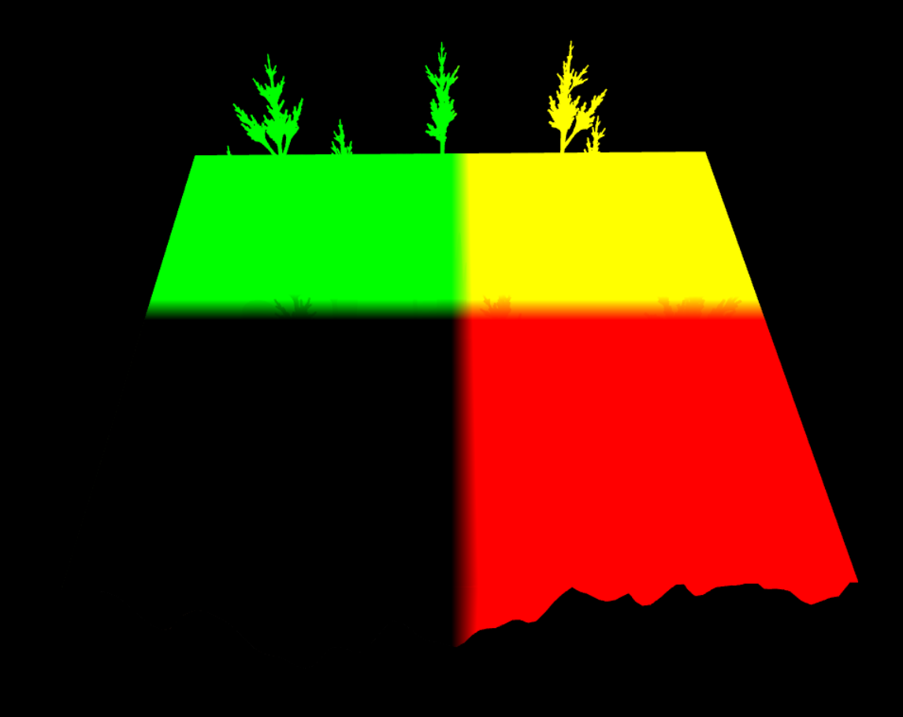
    <figcaption>Position buffer</figcaption>
  </figure>

  <figure style="display: inline-block; margin: 10px;">
    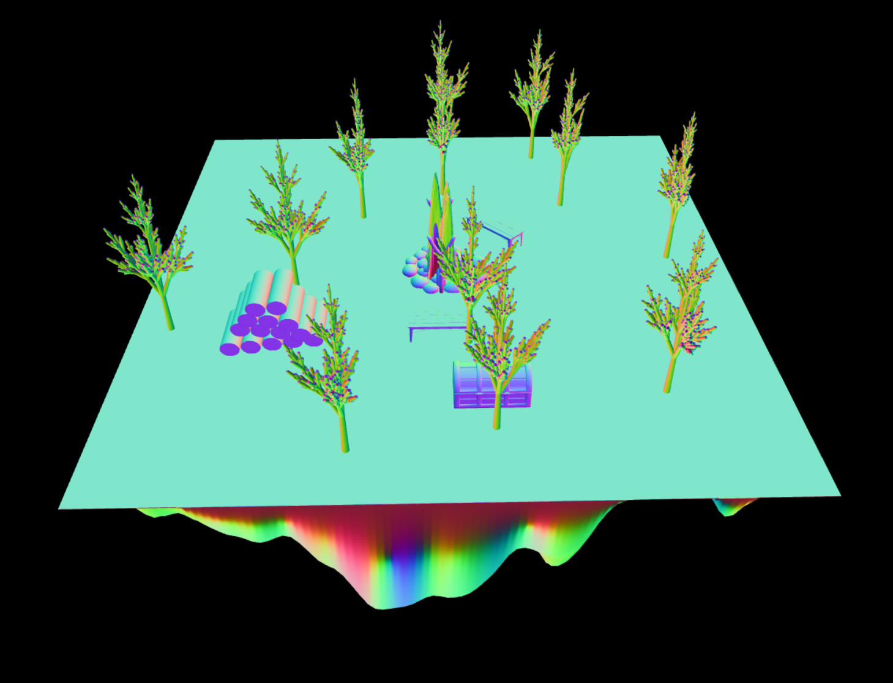
    <figcaption>Normal buffer</figcaption>
  </figure>

  <figure style="display: inline-block; margin: 10px;">
    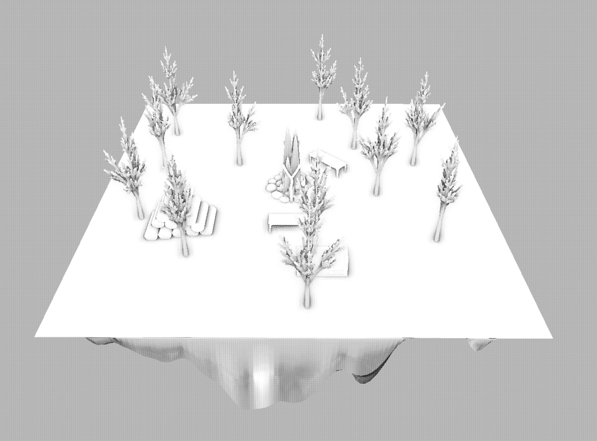
    <figcaption>Raw SSAO output</figcaption>
  </figure>

  <figure style="display: inline-block; margin: 10px;">
    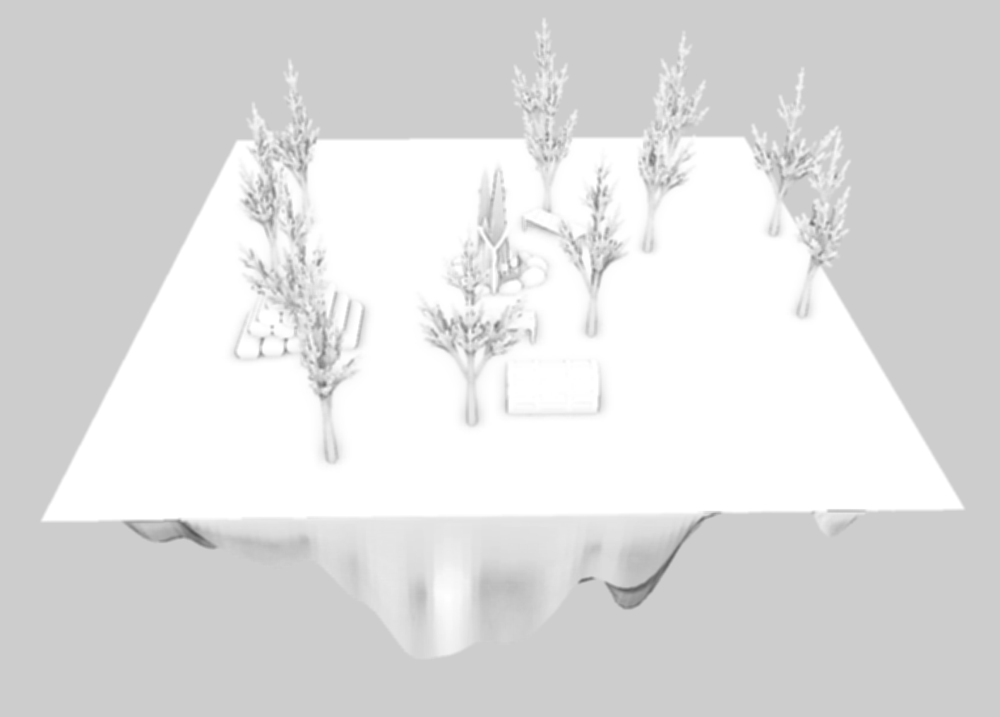
    <figcaption>Blurred SSAO output</figcaption>
  </figure>

 

<<<<<<< Updated upstream
In order to visualize the effect, here is the same scene with and without SSAO. Look especially at the lighting around the tree.

<video src="videos/SSAO_Validation.mp4" height="300px" autoplay loop></video>
||||||| Stash base
In order to visualize the effect, here is the same scene with and without SSAO. Look especially at the lighting around the tree.

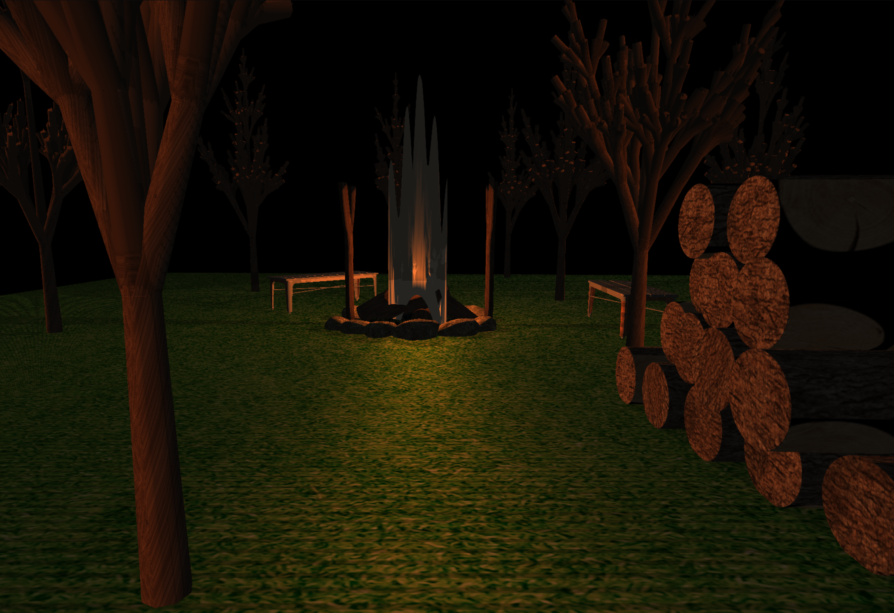
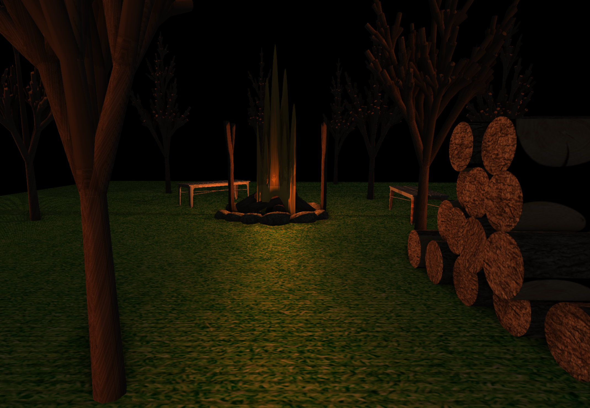
=======

  
To visualize the effect of SSAO, here is the same scene with and without SSAO. Notice the enhanced shadowing around the base of the trees:

>>>>>>> Stashed changes

  <figure style="display: inline-block; margin: 10px;">
    
    <figcaption>Scene without SSAO</figcaption>
  </figure>

  <figure style="display: inline-block; margin: 10px;">
    
    <figcaption>Scene with SSAO</figcaption>
  </figure>

### Feature 5 : L-Systems

#### Implementation

This implementation generates a 3D procedural tree mesh using an L-system and simulates plant-like branching structures. It uses two main things: an axiom and a set of rules.
From the axiom, it recursively replaces each element based on the rule set until it reaches the specified number of iterations. It then draws using a turtle based algorithm, the turtle keeps a state throught the drawing process. This state contains its positions, three vectors that represent a moving orthogonal basis, the current thickness and height of the cylinder as well the last ring for optimization purposes.

The L-Systems rules contain some special characters :

`[` : Saves the current state of the turtle into a stack.

`]` : Pops the previously saved state from the stack.

`+` : Rotates the angle along +x.

`-` : Rotates the angle along -x.

`^` : Rotates the angle along +y.

`&` : Rotates the angle along -y.

Then, for each character not among these, the turtle draws a cylinder by computing the center points and surrounding circle points then extracts the faces. And for each cylinder, it has a probability to draw a branch with is just a generated simple triangle mesh for randomness. Then we compute normals using triangle normals and angle weights using the same method as the previous assignments.

#### Validation

Here is some outputs for different iterations:

  <!-- L-System Tree Iterations -->
  <figure style="display: inline-block; margin: 10px;">
    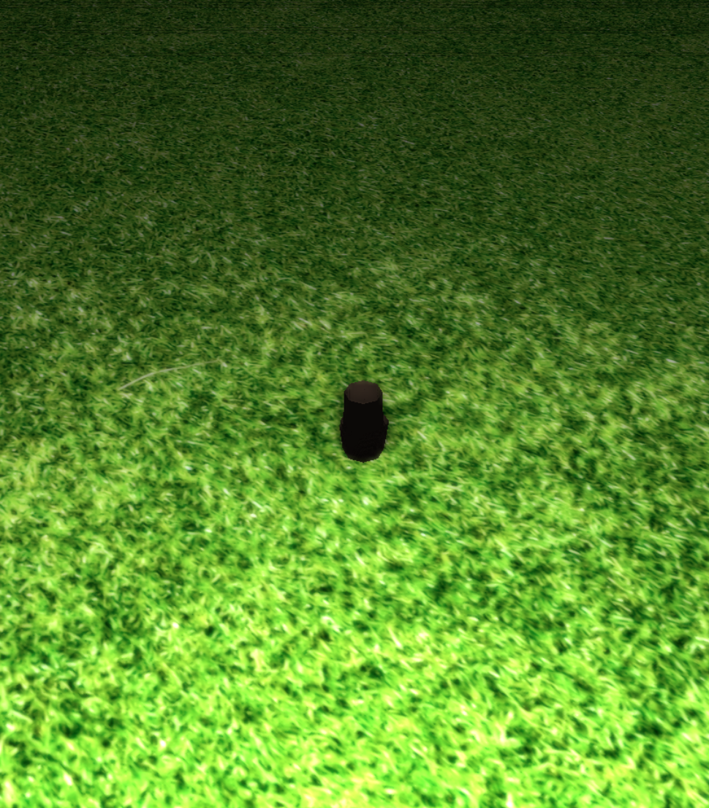
    <figcaption>Tree generated using L-System - Iteration 1</figcaption>
  </figure>

  <figure style="display: inline-block; margin: 10px;">
    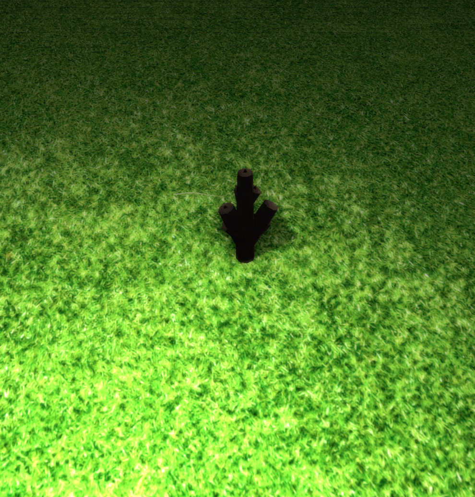
    <figcaption>Tree generated using L-System - Iteration 2</figcaption>
  </figure>

  <figure style="display: inline-block; margin: 10px;">
    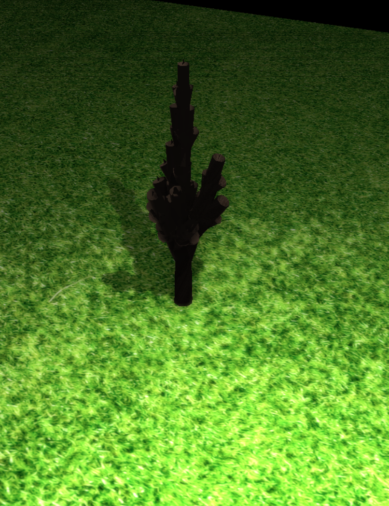
    <figcaption>Tree generated using L-System - Iteration 3</figcaption>
  </figure>

  <figure style="display: inline-block; margin: 10px;">
    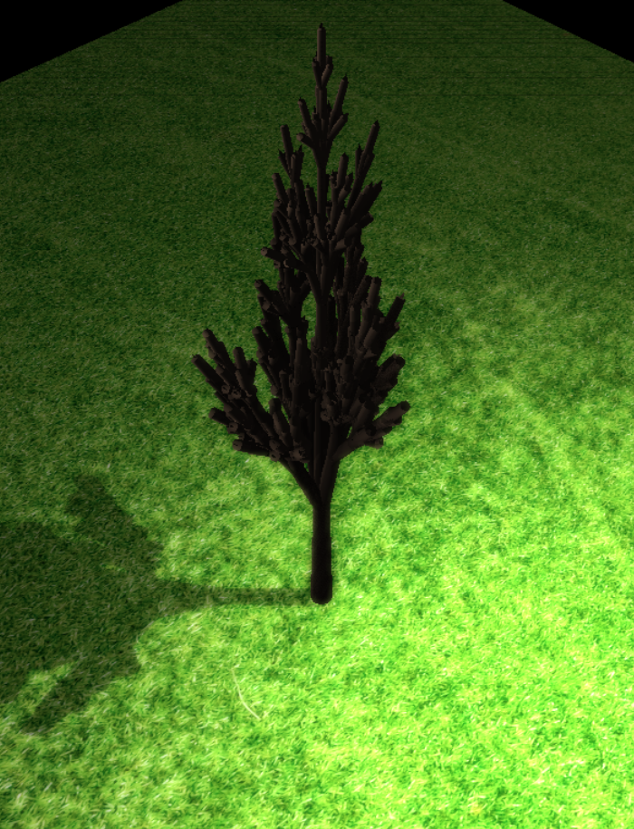
    <figcaption>Tree generated using L-System - Iteration 4</figcaption>
  </figure>

 
Below are examples of popular L-System based fractals:
 

  <figure style="display: inline-block; margin: 10px;">
    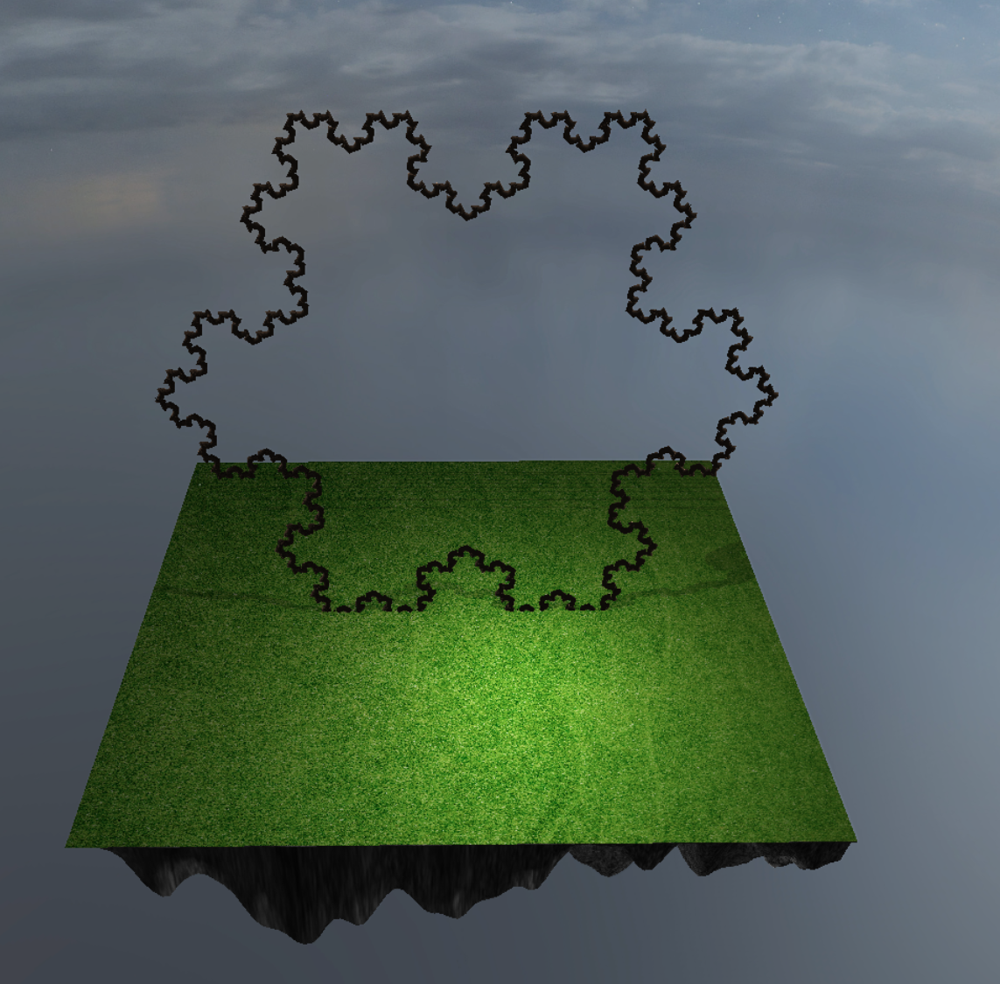
    <figcaption>Koch Snowflake - A classic fractal generated using an L-System</figcaption>
  </figure>

  <figure style="display: inline-block; margin: 10px;">
    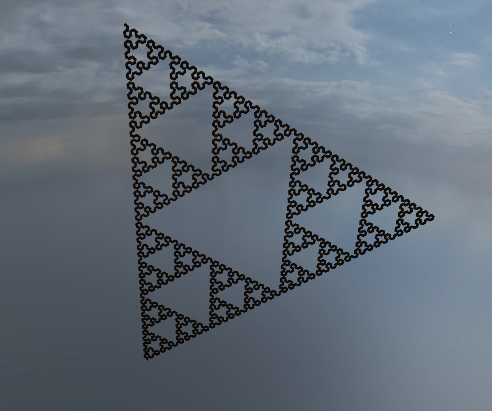
    <figcaption>Sierpiński Triangle - Another well-known L-System fractal</figcaption>
  </figure>

### Feature 6: Mesh / Scene Design

#### Implementation

The mesh and scene design played a central role in constructing the visual environment of **"A Campfire At Midnight."** The scene was built using a combination of procedural generation and manual modeling to create a cohesive and immersive setting.

#### Mesh Design

**Procedural Terrain Generation**  
The terrain was procedurally generated using noise functions to form a floating island, serving as the foundation for all other scene elements. This approach allowed for natural variation in the landscape while maintaining a stylized aesthetic.

**Flame Mesh**  
The campfire flame was designed using a procedurally generated mesh, enhanced with animated textures. These elements worked together to simulate flame motion and depth, resulting in a more dynamic and engaging visual effect.

**Environment Elements**  
Objects such as rocks, logs, and vegetation were added to support the campfire setting. These elements were positioned to align with the terrain and were textured to maintain visual consistency throughout the scene.

#### Scene Design

**Atmospheric Lighting**  
A dynamic lighting system was used to simulate the warm illumination of a campfire. The light source was programmed to adjust its position in real time, always aligning with the highest elevation point of the flame. This setup produced soft shadows and interacted with nearby objects to enhance the perception of depth in the scene.

#### Validation

TODO

## Discussion

### Additional Components

#### Flame Generation Approach

Although the original approach focused only on using procedurally generated textures for the flame, it was later decided to also incorporate a procedurally generated mesh. This combination provided greater visual depth and contributed to a more dynamic and realistic flame effect. For a more technical explanation, refer to **Feature 1**.

### Failed Experiments

Despite progress, two major issues with soft shadow rendering remain unresolved.

#### Issues in Soft Shadow Implementation

During the development of soft shadow rendering, two primary visual issues were encountered. These affect the consistency and realism of shadows across different lighting conditions and viewing angles.

__-> 1. Inconsistent Shadow Rendering Near Light Sources:__  

In some situations—especially around bright light sources like the flame of the campfire and from certain camera angles—soft shadows were missing or appeared unnaturally sharp. This led to inconsistent lighting and a less realistic appearance.

 

  
  <figcaption>Figure: Missing soft shadows near the campfire light source.</figcaption>

 

**Potential Causes:**

- **Cube Mapping Limitations**: Fragments near the edges of the cube map’s coverage may lack sufficient detail.
- **Poisson Disk Sampling Variation**: The shadow softness depends on the sampling distribution, which may produce inconsistent results depending on the view angle and location.

**Potential Mitigation Strategies:**

- **Increased Sampling Resolution**: More Poisson disk samples can produce smoother shadow edges, at a higher computational cost.
- **Adjustable Shadow Softness**: Dynamically modifying the `shadow_softness` parameter, possibly based on distance to the light source.
- **Bias Optimization**: Carefully adjusting the bias used in depth comparisons to reduce shadow acne and artifacts.
- **Hybrid Shadow Techniques**: Mixing soft and hard shadows to balance realism and detail near complex lighting regions.
- **Higher Cube Map Resolution**: Improves detail capture and helps reduce shadow loss near bright or complex surfaces.

__-> 2. Artifacts at Greater Distances:__  

On distant terrain surfaces, especially in shadowed regions, visual artifacts such as black lines were visible. These disrupted the visual flow and were particularly noticeable in low-light conditions.

 

  
  <figcaption>Figure: Black line artifacts appearing in distant shadows on terrain surfaces.</figcaption>

 

**Potential Causes:**

- **Depth Precision Loss**: Shadow map precision decreases with distance, leading to inaccurate shadow results.
- **Insufficient Sampling Coverage**: Poisson disk samples may not provide adequate variation at longer distances.
- **Fixed Bias Limitations**: A uniform bias does not adapt well to varying fragment depths, resulting in incorrect shadowing.

**Potential Solutions:**

- **Higher Shadow Map Resolution**: Improves shadow accuracy and reduces artifacts in large or distant surfaces.
- **Distance-Based Biasing**: Modifying bias based on fragment distance to improve consistency across depth ranges.
- **Post-Processing Filters**: Applying blur or blending filters during post-processing to smooth out hard lines or discontinuities.

### Challenges

Before settling on the final scene, we explored numerous different approaches and had to backtrack several times. Here is a compilation of some of the alternative methods and ideas that were tested but ultimately set aside.

  
  
Terrain generation using a weird height map created unstable and exaggerated shapes that looked unrealistic.

  
  
Another terrain attempt with an odd height map led to exaggerated shapes that looked unrealistic.

  
  
Incorrect bloom parameters resulted in overly bright highlights and loss of visual detail.

  
  
Sky brightness caused the bloom effect to be exaggerated, making the upper part of the scene overly intense.

  
  
Combining fire mesh from Blender* with dynamic properties lacked realism and visual clarity.

  
  
Procedural flame using noise produced awkward shapes that didn’t look natural.

\* *We later replaced the Blender-created flame with a procedurally generated mesh and applied a procedural texture on top, which better captured the desired dynamic and natural appearance.*

Despite the setbacks shown above, we were able to resolve all of them through iterative improvements. We included these failed attempts in the report as a trace of the development process and the challenges we faced and overcame.

## Contributions

<table>
	<caption>Worked hours</caption>
	<thead>
		<tr>
			<th>Name</th>
			<th>Week 1</th>
			<th>Week 2</th>
			<th>Week 3</th>
			<th>Week 4</th>
			<th>Week 5</th>
			<th>Week 6</th>
			<th>Week 7</th>
			<th>Total</th>
		</tr>
	</thead>
	<tbody>
		<tr>
			<td>Walid Ait Said</td>
			<td>8</td>
			<td style="background-color: #f0f0f0;"></td>
			<td>10</td>
			<td>7</td>
			<td>6</td>
			<td>8</td>
			<td>10</td>
			<td>50</td>
		</tr>
		<tr>
			<td>Youssef Benhayoun Sadafi</td>
			<td>8</td>
			<td style="background-color: #f0f0f0;"></td>
			<td>11</td>
			<td>7</td>
			<td>7</td>
			<td>6</td>
			<td>10</td>
			<td>50</td>
		</tr>
		<tr>
			<td>Adam Bekkar</td>
			<td>8</td>
			<td style="background-color: #f0f0f0;"></td>
			<td>10</td>
			<td>6</td>
			<td>8</td>
			<td>7</td>
			<td>10</td>
			<td>50</td>
		</tr>
	</tbody>
</table>

<table>
	<caption>Individual contributions</caption>
	<thead>
		<tr>
			<th>Name</th>
			<th>Contribution</th>
		</tr>
	</thead>
	<tbody>
		<tr>
			<td>Walid Ait Said</td>
			<td>1/3</td>
		</tr>
		<tr>
			<td>Youssef Benhayoun Sadafi</td>
			<td>1/3</td>
		</tr>
		<tr>
			<td>Adam Bekkar</td>
			<td>1/3</td>
		</tr>
	</tbody>
</table>

## References

### 📚 **Books**

- **Marschner & Shirley: _Fundamentals of Computer Graphics_, 5th Edition, AK Peters, 2021**
- **Glassner: _Graphics Gems_, Academic Press, 1989**
- **Ebert, Musgrave, Peachey, Perlin, Worley: _Texturing & Modeling: A Procedural Approach_, 3rd Edition**

### 🌐 **Blogs**

- [3D Game Shaders for Beginners](https://github.com/lettier/3d-game-shaders-for-beginners)

### 🎓 **Online Tutorials**

- [Awesome Computer Graphics Resources by lettier](https://github.com/lettier/awesome-computer-graphics)
- [Introduction to Computer Graphics by Cem Yuksel](https://www.youtube.com/watch?v=vLSphLtKQ0o&list=PLplnkTzzqsZTfYh4UbhLGpI5kGd5oW_Hh)
- [Blender 4.0 Beginner Donut Tutorial (Newest) by Blender Guru](https://youtube.com/playlist?list=PLjEaoINr3zgEPv5y--4MKpciLaoQYZB1Z&si=tnK_WiwRdk_pP7cw)
- [Learn OpenGL: Learn modern OpenGL graphics programming in a step-by-step fashion](https://learnopengl.com/)

### 🖼️ **Meshes and Textures**

- [Benches](https://free3d.com/3d-model/hipster-bench-83378.html)
- [Campfire](https://www.cgtrader.com/free-3d-models/various/various-models/campfire-7c95f25c-078b-4386-b6b6-fed4b0a0375b)
- [Grass](https://www.freepik.com/free-photo/green-grass-texture_969018.htm#fromView=keyword&page=1&position=37&uuid=6a92b9ae-c3d6-4912-ad3f-e0337f5b4947&query=Grass+Texture)
- [Chest](https://sketchfab.com/3d-models/medieval-chest-e84b6208cbb148ab9a32d6c52897dad1)
- [Sky Island](https://www.freepik.com/free-photo/closeup-shot-gray-rough-concrete-background_9990863.htm#fromView=keyword&page=1&position=45&uuid=ac5cc307-b3ab-4939-b72e-3ac48c98413d&query=Rock+Texture)