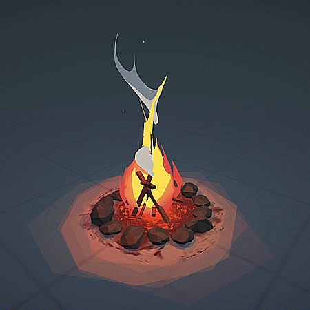

# Project Title : Campfire at Midnight

<table>
  <tr>
	<td>
	  
	  
<em>Figure 1: A campfire illustration utilizing noise functions for fire and smoke. Credit: Rody Muijrers</em>

	</td>
	<td>
	  
	  
<em>Figure 2: Spruce trees generated using L-systems. Credit: Tomáš Stolárik </em>

	</td>
  </tr>
</table>

## Abstract

### What do you want to achieve?

We aim to create a visually compelling and interactive real-time campfire simulation that showcases advanced computer graphics techniques. The centerpiece is a dynamically illuminated environment with realistic fire and smoke effects, accompanied by procedurally generated vegetation using L-Systems. The experience should evoke a naturalistic nighttime scene with rich lighting, ambiance, and depth.

---

### How do you plan to do it?

We plan to implement the simulation using the **regl** framework for WebGL-based rendering. The project will combine several techniques:

- **Soft Shadows** to realistically diffuse firelight across the scene.
- **Screen-Space Ambient Occlusion (SSAO)** to add depth and shading detail.
- **Procedural Texture Generation** for fire and smoke animations.
- **L-System algorithms** for generating tree structures and organic forms.
- **Scene modeling** in Blender for static elements like the fire pit and benches.
- **Bloom effect** to emphasize the glow and warmth of the campfire.

---

### Why do you think it is interesting?

This project is interesting because it blends technical complexity with artistic expression. Fire and natural lighting are notoriously difficult to simulate convincingly, especially in real-time and with procedural variation. By combining physically based lighting, procedural modeling, and real-time shading, we explore how to balance realism and performance. The final product has potential uses in games, simulations, or even meditative or storytelling environments.

---

### Which new techniques or algorithms do you plan to add to the regl framework?

We are considering contributing or adapting several advanced techniques to the **regl** ecosystem, depending on their feasibility and compatibility with real-time performance, like:

- **Soft shadow rendering** using variance or PCF (Percentage-Closer Filtering) approaches.
- **Real-time procedural texture shaders** for animated fire and smoke using noise functions (e.g., Perlin or Worley noise).
- **L-System interpreters** embedded in GLSL or as a preprocessing step, enabling dynamic generation of tree meshes.
- **Custom SSAO shader** implementation tailored for real-time rendering in WebGL.

---

### Which are the technical challenges you expect to face?

- **Performance Constraints**: Maintaining real-time frame rates while handling complex lighting and procedural effects.
- **Fire Simulation**: Creating believable fire and smoke without relying on pre-baked textures.
- **Shadow Accuracy**: Soft shadows can be expensive and difficult to implement correctly in a physically plausible way.
- **Procedural Tree Generation**: Balancing visual richness with the limitations of browser-based rendering.
- **Shader Complexity**: Combining multiple effects (SSAO, bloom, noise-based animation) in a coherent shader pipeline. 

## Features

| Index  | Feature          	| Points | Adapted Points |
|--------|----------------------|--------|----------------|
| 1 	 | Soft Shadows    		| 20     | 10             |
| 2 	 | SSAO    				| 20     | 10             |
| 3 	 | PTG*		| 10     | 10             |
| 4 	 | L-Systems        	| 10     | 10             |
| 5 	 | Mesh/Scene Design	| 5      | 5              |
| 6 	 | Bloom       			| 5      | 5              |

*PTG : Procedural Texture Generation

## Schedule

<table>
	<tr>
		<th style="width: 20%"></th>
		<th>Adam Bekkar</th>
		<th>Walid Ait Said</th>
		<th>Youssef Benhayoun Sadafi</th>
	</tr>
	<tr>
		<td>Week 1</td>
		<td>Write detailed proposal</td>
		<td>Adapt points and find relevant resources</td>
		<td>Find ideas and corresponding features</td>
	</tr>
	<tr style="background-color: #f9f9f9;">
		<td colspan="4" align="center">Proposal</td>
	</tr>
	<tr>
		<td>Week 2 (Easter)</td>
		<td></td>
		<td></td>
		<td></td>
	</tr>
	<tr>
		<td>Week 3</td>
		<td>Look into lighting effects</td>
		<td>Start looking for or construct meshes for scene modeling</td>
		<td>Look into L-systems and procedural generation</td>
	</tr>
	<tr>
		<td>Week 4</td>
		<td>Start implementing shaders for ambient occlusion</td>
		<td>Use blender and add meshes to the scene</td>
		<td>Start tree generation code</td>
	</tr>
	<tr style="background-color: #f9f9f9;">
		<td colspan="4" align="center">Milestone</td>
	</tr>
	<tr>
		<td>Week 5</td>
		<td>Finalize ambiant occlusion shaders and look into boom effect</td>
		<td>Finalize base scene and start looking into soft shadows</td>
		<td>Implement tree generation shaders and look into texture generation</td>
	</tr>
	<tr>
		<td>Week 6</td>
		<td>Fully implement Bloom effect</td>
		<td>Complete shadows implementation</td>
		<td>Finalize campfire textures</td>
	</tr>
	<tr>
		<td>Week 7</td>
		<td>Edit the video to be showcased</td>
		<td>Record a comprehensive demo</td>
		<td>Write detailed report</td>
	</tr>
	<tr style="background-color: #f9f9f9;">
		<td colspan="4" align="center">Video and Report</td>
	</tr>
</table>

## Resources

### 📚 **Books**

- **Marschner & Shirley: _Fundamentals of Computer Graphics_, 5th Edition, AK Peters, 2021**
- **Glassner: _Graphics Gems_, Academic Press, 1989**
- **Ebert, Musgrave, Peachey, Perlin, Worley: _Texturing & Modeling: A Procedural Approach_, 3rd Edition**

### 🌐 **Blogs**

- [3D Game Shaders for Beginners](https://github.com/lettier/3d-game-shaders-for-beginners)

### 🎓 **Online Tutorials**

- [Awesome Computer Graphics Resources by lettier](https://github.com/lettier/awesome-computer-graphics)
- [Introduction to Computer Graphics by Cem Yuksel](https://www.youtube.com/watch?v=vLSphLtKQ0o&list=PLplnkTzzqsZTfYh4UbhLGpI5kGd5oW_Hh)
- [Blender 4.0 Beginner Donut Tutorial (Newest) by Blender Guru](https://youtube.com/playlist?list=PLjEaoINr3zgEPv5y--4MKpciLaoQYZB1Z&si=tnK_WiwRdk_pP7cw)

We may also need to use AI tools as ChatGPT, Copilot or Midjourney depending on the need for coding help and image generation.

## The group members

Adam Bekkar (379476)

Youssef Benhayoun Sadafi (358748)

Walid Ait Said (356082)