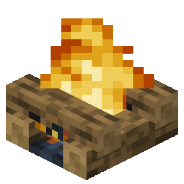

# Project Title : Campfire at Midnight

{width="300px"}

## Abstract

### Objective

This project aims to create a real-time, interactive campfire simulation that emphasizes physically-based lighting and procedurally generated content. The central visual element is a fire source, which dynamically illuminates a structured environment featuring vegetation and procedurally generated trees modeled using L-Systems.

### Technical Focus

The implementation will leverage a range of computer graphics techniques, including:

- **Soft Shadows**
  Simulate realistic light diffusion from the fire source, producing natural and physically accurate shadow gradients.

- **Screen-Space Ambient Occlusion (SSAO)**
  Improve local shading and depth perception by approximating occlusion effects using depth buffer data.

- **Procedural Texture Generation (PTG)**
  Generate dynamic fire and smoke textures in real time, allowing for continuous variation in particle appearance.

- **L-System-Based Procedural Tree Generation**
  Use algorithmic rules to model tree geometry, providing scalable and varied vegetation for the environment.

- **Scene and Mesh Design**
  Construct the campfire environment by modeling key static elements such as the ground surface, fire pit, wooden benches, stacked firewood, and surrounding objects.

- **Bloom Effect**
  Enhance the perception of brightness and glow in nighttime scenes, particularly around high-intensity light sources like fire.

## Featuress

| Index  | Feature          	| Points | Adapted Points |
|--------|----------------------|--------|----------------|
| 1 	 | Soft Shadows    		| 20     | 10             |
| 2 	 | SSAO    				| 20     | 10             |
| 3 	 | PTG*		| 10     | 10             |
| 4 	 | L-Systems        	| 10     | 10             |
| 5 	 | Mesh/Scene Design	| 5      | 5              |
| 6 	 | Bloom       			| 5      | 5              |

*PTG : Procedural Texture Generation

## Schedule

<table>
	<tr>
		<th style="width: 20%"></th>
		<th>Name 1</th>
		<th>Name 2</th>
		<th>Name 3</th>
	</tr>
	<tr>
		<td>Week 1</td>
		<td></td>
		<td></td>
		<td></td>
	</tr>
	<tr style="background-color: #f9f9f9;">
		<td colspan="4" align="center">Proposal</td>
	</tr>
	<tr>
		<td>Week 2 (Easter)</td>
		<td></td>
		<td></td>
		<td></td>
	</tr>
	<tr>
		<td>Week 3</td>
		<td></td>
		<td></td>
		<td></td>
	</tr>
	<tr>
		<td>Week 4</td>
		<td></td>
		<td></td>
		<td></td>
	</tr>
	<tr style="background-color: #f9f9f9;">
		<td colspan="4" align="center">Milestone</td>
	</tr>
	<tr>
		<td>Week 5</td>
		<td></td>
		<td></td>
		<td></td>
	</tr>
	<tr>
		<td>Week 6</td>
		<td></td>
		<td></td>
		<td></td>
	</tr>
	<tr>
		<td>Week 7</td>
		<td></td>
		<td></td>
		<td></td>
	</tr>
	<tr style="background-color: #f9f9f9;">
		<td colspan="4" align="center">Video and Report</td>
	</tr>
</table>

## Resources

### 📚 **Books**

- **Marschner & Shirley: _Fundamentals of Computer Graphics_, 5th Edition, AK Peters, 2021**
- **Glassner: _Graphics Gems_, Academic Press, 1989**
- **Ebert, Musgrave, Peachey, Perlin, Worley: _Texturing & Modeling: A Procedural Approach_, 3rd Edition**

### 🌐 **Blogs**

- [3D Game Shaders for Beginners](https://github.com/lettier/3d-game-shaders-for-beginners)

### 🎓 **Online Tutorials**

- [Awesome Computer Graphics Resources by lettier](https://github.com/lettier/awesome-computer-graphics)
- [Introduction to Computer Graphics by Cem Yuksel](https://www.youtube.com/watch?v=vLSphLtKQ0o&list=PLplnkTzzqsZTfYh4UbhLGpI5kGd5oW_Hh)
- [Blender 4.0 Beginner Donut Tutorial (Newest) by Blender Guru](https://youtube.com/playlist?list=PLjEaoINr3zgEPv5y--4MKpciLaoQYZB1Z&si=tnK_WiwRdk_pP7cw)

We may also need to use AI tools as ChatGPT, Copilot or Midjourney depending on the need for coding help and image generation.
